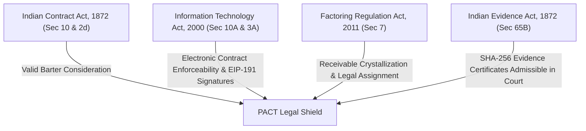

# PACT Protocol — Legal Shield & Enforceability Analysis (India Jurisdiction)

## Executive Summary

This document establishes the legal enforceability framework for **PACT (Programmable Agreement Capital Technology)** under Indian jurisprudence. 

Because digital tokens and cryptocurrencies are not recognized as legal tender in India (under the Reserve Bank of India Act, 1934), PACT structures tokenized financing transactions as a **Dual Legal Contract**:
1. **Primary Contract**: Statutory Assignment of Receivables under **Section 7 of the Factoring Regulation Act, 2011**.
2. **Consideration & Settlement Mechanism**: Valid **Barter Exchange Contract** under **Section 2(d) & Section 10 of the Indian Contract Act, 1872**, where CVA digital token positions (classified as movable property / actionable claims) are exchanged for assigned debt obligations.

---

## 1. Statutory Pillars & Legal Analysis



### Pillar 1: Indian Contract Act, 1872 — Barter & Consideration
* **Section 10 (Validity)**: Contracts are legally binding if executed with free consent, competent parties, lawful object, and lawful consideration.
* **Section 2(d) (Consideration & Barter Framework)**: Consideration is defined as any act or promise performed at the desire of the promisor. **Indian law does NOT require consideration to be legal tender (INR).**
* **Barter Enforceability**: Exchanging a digital asset (CVA token position) for an assigned commercial receivable constitutes a valid *Barter Agreement* under Indian law. The CVA token represents an **Actionable Claim** or **Movable Property** (under Sec 2(7) of the Sale of Goods Act, 1930).

### Pillar 2: Information Technology Act, 2000 — Electronic Contracts & Signatures
* **Section 10A (Validity of Electronic Contracts)**: Explicitly provides that contracts formed electronically via digital communication shall not be denied validity or enforceability solely because they are in electronic form.
* **Section 3 & 3A (Digital & Electronic Signatures)**: EIP-191 `personal_sign` signatures (`keccak256(chain + contractAddress)`) signed by asymmetric private keys satisfy statutory electronic authentication requirements when backed by verifiable key ownership.

### Pillar 3: Factoring Regulation Act, 2011 — Receivable Assignment
* **Section 7 (Assignment of Receivables)**: Allows a supplier (assignor) to transfer its receivable rights against a buyer (debtor) to a factor/financier. Upon notice of assignment, the buyer becomes directly liable to pay the factor.
* **Legal Wrapper `PACT-IN-1`**: Integrates standard Section 7 assignment clauses into every `PactAgreement.sol` obligation crystallization step.

### Pillar 4: Indian Evidence Act, 1872 (Sec 65B) — Admissibility of Onchain Evidence
* **Section 65B Certificate**: Onchain event logs in `LegalEventRegistry.sol` recording SHA-256 hashes of commercial invoices, delivery receipts, and EIP-191 signatures are admissible in Indian courts when accompanied by automated Section 65B electronic evidence certificates.

---

## 2. PACT Transaction Lifecycle & Legal Mechanics

| Phase | Onchain Action | Statutory Legal Characterization | Evidence Artifact |
| :--- | :--- | :--- | :--- |
| **1. Execution** | Agreement deployed & signed (`DRAFT` $\rightarrow$ `ACTIVE`) | Executory Commercial Supply Contract under Sec 10, Indian Contract Act | EIP-191 `personal_sign` signature hash |
| **2. Fulfillment** | Supplier submits shipment evidence (`DELIVERY_ACCEPTED`) | Proof of Performance under Sec 37, Indian Contract Act | SHA-256 Delivery Receipt Hash |
| **3. Crystallization** | Obligation shifts to `CRYSTALLIZED` under `PACT-IN-1` | Unconditional Debt Obligation / Crystallized Receivable under Factoring Act Sec 7 | Buyer Acceptance Stamp + `receivableId` |
| **4. Encumbrance** | `claimFingerprint` registered in `EncumbranceRegistry.sol` | Perfection of Security Interest & First-in-Time Priority (Sec 48, Contract Act) | Cryptographic Claim Fingerprint |
| **5. Financing** | Financier funds position & receives CVA asset token | Barter Contract (CVA Movable Property exchanged for Assigned Debt) | CVA Mint Transaction Hash |
| **6. Settlement** | Buyer settles payment / CVI release | Discharge of Contractual Debt | Onchain Settlement Event |

---

## 4. Worst-Case Legal Shield Scenarios (Court Viability)

### Scenario A: Fraudulent Double-Financing by Supplier
* **Risk**: Supplier tries to factor the same invoice to a traditional bank after receiving crypto/CVA financing on PACT.
* **PACT Legal Shield**: The `EncumbranceRegistry.sol` registers a deterministic `claimFingerprint`:
  $$\text{claimFingerprint} = \text{keccak256}(\text{agreementHash}, \text{obligor}, \text{beneficiary}, \text{obligationId}, \text{amount}, \text{dueDate})$$
* **Court Result**: Under **Section 48 of the Indian Contract Act** and **Section 7 of the Factoring Regulation Act**, the financier holding the prior `claimFingerprint` holds **first-in-time legal priority**. The second attempted assignment is void *ab initio*.

### Scenario B: Buyer Disputes Delivery Quality Post-Crystallization
* **Risk**: Buyer claims goods were defective after accepting delivery.
* **PACT Legal Shield**: Under `PACT-IN-1`, crystallization requires explicit buyer acceptance evidence. Once crystallized, the debt becomes an **unconditional actionable claim** in the hands of the financier.
* **Court Result**: Under Section 7(2) of the Factoring Regulation Act, buyer defenses against the supplier cannot be set off against a *bona fide* assignee financier who acquired the crystallized receivable for value.

### Scenario C: Regulatory Volatility / Non-Legal Tender Defense
* **Risk**: Counterparty argues the financing is invalid because CVA tokens are not legal tender.
* **PACT Legal Shield**: PACT explicitly structures token transfers as a **Barter Agreement of Movable Goods/Claims** under Section 2(d) of the Indian Contract Act, not a legal tender currency loan.
* **Court Result**: Indian courts enforce barter contracts under general contract law. Consideration in the form of property/tokens is valid consideration.

---

## 5. Summary Matrix for Developers & Judges

```text
⚖️ LEGAL SHIELD CHECKS:
[✓] Indian Contract Act 1872 Sec 10 & 2(d)  --> Valid Barter Consideration
[✓] IT Act 2000 Sec 10A & 3A                --> Binding Electronic Signatures & EIP-191
[✓] Factoring Regulation Act 2011 Sec 7     --> Statutory Receivable Assignment (PACT-IN-1)
[✓] Indian Evidence Act Sec 65B              --> Admissibility of SHA-256 Onchain Audit Trail
[✓] Encumbrance Registry Claim Fingerprint   --> First-in-Time Protection Against Fraud
```
